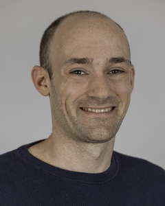
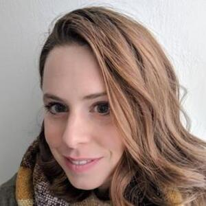
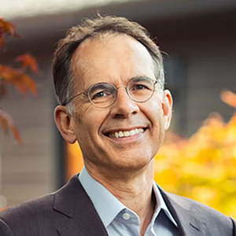
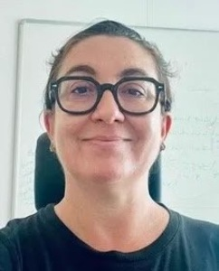
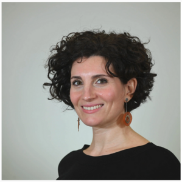
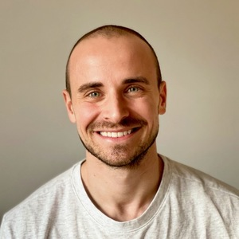
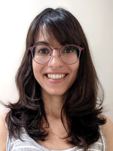
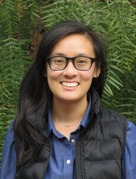
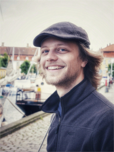

# EuroCIM 2027 Paris, France

The conference will be from 14-16 April 2027, with pre-conference courses on the 13th.

More information coming soon!

## Key dates

| Event | Date |
|------------------------|--------------------|
| Pre-conference courses | 13 April 2027 |
| EuroCIM Paris | 14-16 April 2027 |

## Venue

Campus Saint-Germain 
Université Paris Cité 
45 rue des Saints-Pères 
75270 Paris cedex 06 
France

[Get directions on Google maps](https://maps.app.goo.gl/ps5xyJARwKoJh4gu7)

## Keynote speakers

::: {layout-ncol=3}

:::

## Special Talk

## Invited speakers

::: {layout-ncol=3}

:::
