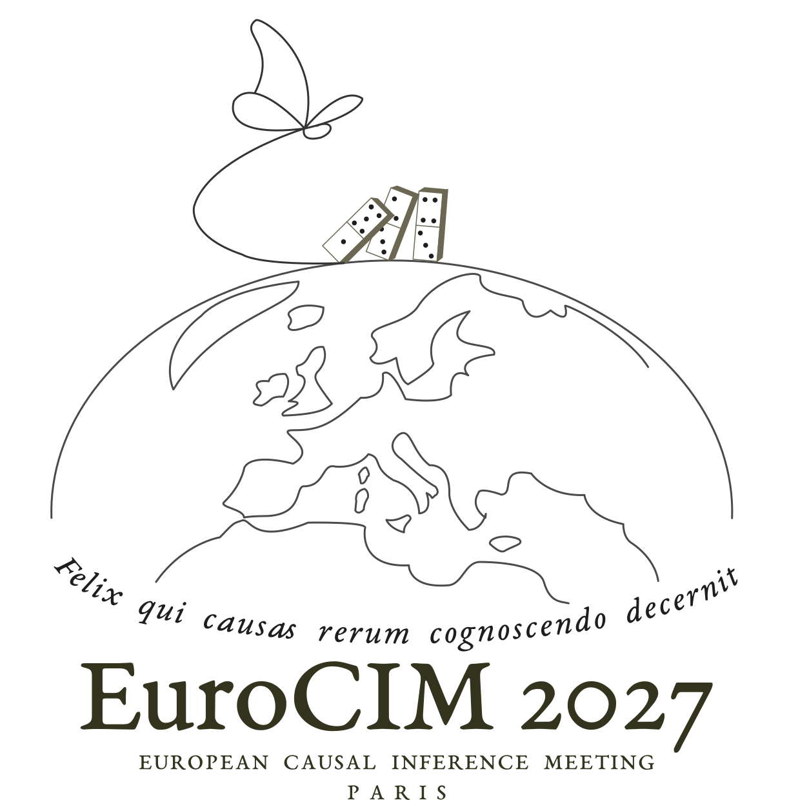

Our sponsorship program offers three levels: **Silver**, **Gold**, and **Platinum**. The table below provides an overview of the benefits included at each sponsorship level. 

Sponsoring EuroCIM offers a unique opportunity to engage with a **highly focused European audience of researchers and practitioners working in causal inference, machine learning, and artificial intelligence**, with direct access to **both early-career researchers and senior methodological leaders**.

We are also happy to **tailor sponsorship opportunities to suit your specific needs**. Please contact us to discuss the available options. For example, sponsorship of social events, such as the **conference dinner or a student gathering**, may also be possible.

For sponsorship inquiries, please [contact the organizers](mailto:eurocim.conf@gmail.com).

| Benefit | Silver - €2,000 | Gold - €4,000 | Platinum - €6,000 |
|---|:---:|:---:|:---:|
| Logo on website and program | ✓  | ✓ | ✓ |
| Larger logo |  | ✓ | ✓ |
| Access to [pre-conference courses](https://eurocim.org/paris-2027/tutorials.html) | ✓ | ✓ | ✓ |
| Complementary registrations | 1 | 2 | 4 |
| Sponsored poster presentation | ✓ | ✓ | ✓ |
| Dedicated sponsor stand |  | ✓ | ✓ |
| Short sponsored oral presentation |  |  | ✓ |
| Acknowledgement during official speeches |  |  | ✓ |

  

{fig-align="center" width=30%}
