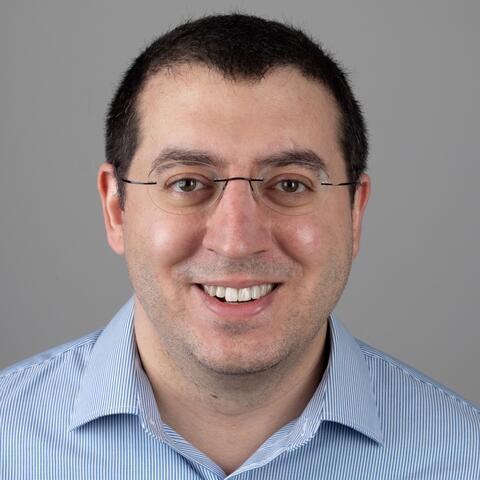
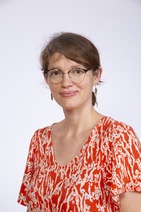

<!--toc: true
toc-depth: 2
editor_options: 
  chunk_output_type: console-->

Tutorials will be on April 13th. 

# Invited Tutorials -- Special Topics

More information coming soon.

::: {layout-ncol=2}

[{height=250px}](https://hsph.harvard.edu/profile/issa-dahabreh/)

[{height=250px}](https://emiliekaufmann.github.io/)

:::

{fig-align="center" width=30%}
